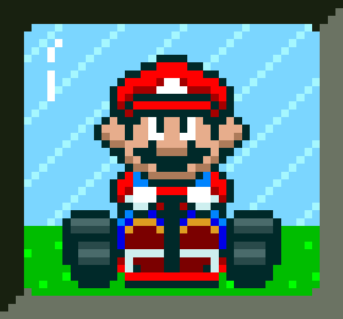

<h1>Simulador de corridas do Mario Kart</h1>

  <table>
        <tr>
            <td>
                
            </td>
            <td>
                <b>Objetivo:</b>
                <p>Mario Kart é uma série de jogos de corrida desenvolvida e publicada pela Nintendo. Nosso desafio será criar uma lógica de um jogo de vídeo game para simular corridas de Mario Kart, levando em consideração as regras e mecânicas abaixo.</p>
            </td>
        </tr>
    </table>

<h2>Players</h2>
      <table style="border-collapse: collapse; width: 800px; margin: 0 auto;">
        <tr>
            <td style="border: 1px solid black; text-align: center;">
                <p>Mario</p>
                
            </td>
            <td style="border: 1px solid black; text-align: center;">
                <p>Velocidade: 4</p>
                <p>Manobrabilidade: 3</p>
                <p>Poder: 3</p>
            </td>
             <td style="border: 1px solid black; text-align: center;">
                <p>Peach</p>
                
            </td>
            <td style="border: 1px solid black; text-align: center;">
                <p>Velocidade: 3</p>
                <p>Manobrabilidade: 4</p>
                <p>Poder: 2</p>
            </td>
              <td style="border: 1px solid black; text-align: center;">
                <p>Yoshi</p>
                
            </td>
            <td style="border: 1px solid black; text-align: center;">
                <p>Velocidade: 2</p>
                <p>Manobrabilidade: 4</p>
                <p>Poder: 3</p>
            </td>
        </tr>
        <tr>
            <td style="border: 1px solid black; text-align: center;">
                <p>Bowser</p>
                
            </td>
            <td style="border: 1px solid black; text-align: center;">
                <p>Velocidade: 5</p>
                <p>Manobrabilidade: 2</p>
                <p>Poder: 5</p>
            </td>
            <td style="border: 1px solid black; text-align: center;">
                <p>Luigi</p>
                
            </td>
            <td style="border: 1px solid black; text-align: center;">
                <p>Velocidade: 3</p>
                <p>Manobrabilidade: 4</p>
                <p>Poder: 4</p>
            </td>
            <td style="border: 1px solid black; text-align: center;">
                <p>Donkey Kong</p>
                
            </td>
            <td style="border: 1px solid black; text-align: center;">
                <p>Velocidade: 2</p>
                <p>Manobrabilidade: 2</p>
                <p>Poder: 5</p>
            </td>
        </tr>
    </table>

<p></p>

<h3>🕹️ Regras & mecânicas:</h3>

<b>Jogadores:</b>

<input type="checkbox" id="jogadores-item" />
<label for="jogadores-item">O Computador deve receber dois personagens para disputar a corrida em um objeto cada</label>

<b>Pistas:</b>

<ul>
  <li><input type="checkbox" id="pistas-1-item" /> <label for="pistas-1-item">Os personagens irão correr em uma pista aleatória de 5 rodadas</label></li>
  <li><input type="checkbox" id="pistas-2-item" /> <label for="pistas-2-item">A cada rodada, será sorteado um bloco da pista que pode ser uma reta, curva ou confronto</label>
    <ul>
      <li><input type="checkbox" id="pistas-2-1-item" /> <label for="pistas-2-1-item">Caso o bloco da pista seja uma RETA, o jogador deve jogar um dado de 6 lados e somar o atributo VELOCIDADE, quem vencer ganha um ponto</label></li>
      <li><input type="checkbox" id="pistas-2-2-item" /> <label for="pistas-2-2-item">Caso o bloco da pista seja uma CURVA, o jogador deve jogar um dado de 6 lados e somar o atributo MANOBRABILIDADE, quem vencer ganha um ponto</label></li>
      <li><input type="checkbox" id="pistas-2-3-item" /> <label for="pistas-2-3-item">Caso o bloco da pista seja um CONFRONTO, o jogador deve jogar um dado de 6 lados e somar o atributo PODER, quem perder, perde um ponto</label></li>
      <li><input type="checkbox" id="pistas-2-3-item" /> <label for="pistas-2-3-item">Nenhum jogador pode ter pontuação negativa (valores abaixo de 0)</label></li>
    </ul>
  </li>
</ul>

<b>Condição de vitória:</b>

<input type="checkbox" id="vitoria-item" />
<label for="vitoria-item">Ao final, vence quem acumulou mais pontos</label>

---
<br>
<br> 
<br>
<br>

# 🏁 Mario Kart.JS — Simulador de Corrida (Node.js)

Projeto desenvolvido como desafio prático do bootcamp de Node.js, com o objetivo de simular, via terminal, a lógica de uma corrida inspirada na franquia **Mario Kart**.

A proposta foi construir uma **engine de corrida baseada em regras**, utilizando JavaScript puro e execução em ambiente Node.js, sem interface gráfica, focando exclusivamente em **lógica, estrutura e controle de fluxo**.

---

## 🎯 Objetivo do Desafio

Criar uma simulação de corrida entre dois personagens, considerando:

* Atributos individuais dos jogadores
* Tipos de terreno sorteados aleatoriamente
* Sistema de disputa por rodada
* Eventos especiais durante confrontos
* Contabilização de pontos até definir o vencedor final

---

## 👥 Personagens

Cada personagem possui três atributos:

| Atributo        | Descrição           |
| --------------- | ------------------- |
| Velocidade      | Desempenho em retas |
| Manobrabilidade | Controle em curvas  |
| Poder           | Força em confrontos |

### Exemplo de estrutura no código:

```js
const player = {
  NOME: "Mario",
  VELOCIDADE: 4,
  MANOBRABILIDADE: 3,
  PODER: 3,
  PONTOS: 0
}
```

---

## 🕹️ Mecânica da Corrida

A corrida acontece em **5 rodadas**, e a cada rodada um tipo de bloco é sorteado:

---

### 🛣️ RETA

* Cada jogador rola um dado de 6 lados (`1–6`)
* Soma-se ao atributo **VELOCIDADE**
* Quem obtiver o maior valor ganha **+1 ponto**

---

### 🌀 CURVA

* Cada jogador rola o dado
* Soma-se ao atributo **MANOBRABILIDADE**
* Quem obtiver o maior valor ganha **+1 ponto**

---

### 🥊 CONFRONTO

* Cada jogador rola o dado
* Soma-se ao atributo **PODER**
* O vencedor ativa um evento especial contra o oponente

---

## 💥 Sistema de Itens (Regra Extra Implementada)

Ao vencer um confronto, um item é sorteado aleatoriamente:

| Item     | Efeito                           |
| -------- | -------------------------------- |
| 🐢 Casco | O adversário perde **-1 ponto**  |
| 💣 Bomba | O adversário perde **-2 pontos** |

> ⚠️ Nenhum jogador pode ficar com pontuação negativa.

---

## 🏎️ Sistema de Turbo (Regra Extra Implementada)

Após vencer um confronto, existe **50% de chance** de ativar um:

**TURBO!**

* O jogador recebe **+1 ponto bônus**

Isso adiciona imprevisibilidade e deixa a corrida mais dinâmica.

---

## 🧠 Conceitos de Programação Aplicados

Este projeto exercita fundamentos essenciais de desenvolvimento backend:

* Estruturação de objetos
* Controle de estado
* Funções assíncronas (`async/await`)
* Geração de números aleatórios
* Regras condicionais complexas
* Simulação baseada em eventos
* Organização lógica de uma "game engine"
* Separação entre dados, regras e execução

---

## ▶️ Como Executar o Projeto

### 1️⃣ Clonar o repositório

```bash
git clone https://github.com/seu-usuario/mario-kart-js.git
```

### 2️⃣ Acessar a pasta

```bash
cd mario-kart-js
```

### 3️⃣ Executar no Node.js

```bash
node index.js
```

---

## 📊 Exemplo de Saída no Terminal

```
🏁 Rodada 3
Bloco: CONFRONTO

Mario 🎲 rolou 5 + Poder 3 = 8
Luigi 🎲 rolou 2 + Poder 4 = 6

Mario venceu o confronto!
Item sorteado: 💣 Bomba

Luigi perdeu 2 pontos!
🏎️ TURBO! Mario ganhou +1 ponto!
```

---

## 🏆 Condição de Vitória

Ao final das 5 rodadas:

✅ Vence quem tiver mais pontos acumulados
🤝 Em caso de empate, a corrida é declarada empatada

---

## 📁 Estrutura do Projeto

```
📦 mario-kart-js
 ┣ 📜 index.js
 ┗ 📜 README.md
```

---

## 🚀 Próximos Passos (Evolução do Projeto)

Esta versão representa a **engine lógica da corrida**.

O próximo passo será evoluir para uma versão **interativa com interface web**, incluindo:

* Seleção visual de personagens
* Rolagem de dados animada
* Simulação da corrida em tempo real
* Dashboard com placar dinâmico

👉 Transformando a simulação em uma experiência jogável.

---

## ✍️ Autor

Projeto Desenvolvido pelo professor da Dio **Felipão** durante o Bootcamp de Node.JS<br>
Regras extras e melhorias desenvolvida por **Kleber Rafael**<br>
Projeto educacional com foco em prática de lógica e JavaScript backend.

